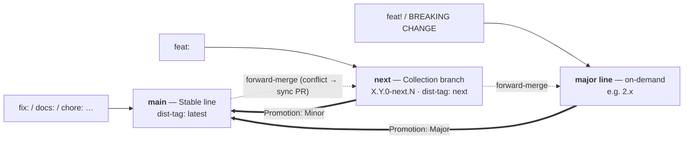

# Flow's release workflow — the map

This document is a **rough overview** of how Flow ships releases: the branches,
what each one publishes, and how a change travels from your pull request to npm.
It is the map, not the runbook — it exists so the model has a durable home in
the repository rather than living only in an issue that can be closed. The
**detailed** cut runbook is deliberately kept out of git; this document is the
overview plus pointers to the authoritative sources.

For where _your_ change should land as a contributor, see the short summary in
[`CONTRIBUTE.md`](../CONTRIBUTE.md#releases) and
[Choosing the base branch](../CONTRIBUTE.md#choosing-the-base-branch). For the
authoritative model, see
[RFC #2711](https://github.com/mittwald/flow/issues/2711).

## The model: two standing lines + an on-demand major line ("2 + n")

Flow runs two permanent branches and, only when it is genuinely needed, one
temporary one.

- **`main` — the Stable line.** Published to npm under dist-tag `latest`. Only
  fixes and non-releasing changes land here (`fix:`, `docs:`, `chore:`,
  `refactor:`, …); merging auto-publishes. This is what "fixes ship fast" means
  — a fix never has to wait behind an unreleased feature.
- **`next` — the Collection branch.** Equals `main` plus every accumulated,
  not-yet-released feature. Published continuously as `X.Y.0-next.N` under
  dist-tag `next` (an early-adopter channel). `feat:` work lands here and is
  promoted to `main` in curated bundles.
- **The major line** — an on-demand branch (e.g. `2.x`) spun up only when a rare
  breaking change appears. Breaking changes are rare _by policy_: **deprecate,
  don't break** — keep the old path and warn via `useWarnDeprecation`.

## How changes flow (the mechanics)

- **Conventional PR titles drive everything.** The repo **squash-merges**, so
  the _PR title_ becomes the release commit that Lerna-Lite reads to derive the
  version bump and changelog. A CI guard (`.github/workflows/commit-guard.yml`)
  enforces both that the title is a valid Conventional Commit and that it is
  routed to the right line — a `feat:` is rejected on `main` (features belong on
  `next`), and a breaking change on both `main` and `next` (it belongs on the
  major line).
- **The changelog is generated by a preset**, configured as `changelogPreset` in
  `lerna.json` — `conventionalcommits`, not Lerna-Lite's default (`angular`).
  The default cannot read a breaking marker: its header pattern does not match
  `feat(X)!:`, so the commit parses to no type and the writer drops it — the
  entry does not move into a BREAKING section, it disappears (#2883). The
  configured preset understands `!` and renders a `⚠ BREAKING CHANGES` section.
  It would also recommend a Major, but no release path derives one: routing
  keeps `!` off `main` and `next`, and the cut and promotion paths set the
  version explicitly. The preset is pinned to `^9`: `10.x` ships a legacy-writer
  guard that Lerna-Lite 5's changelog config trips over (it recompiles the
  preset's template itself), and the guard then aborts `lerna version`. Re-check
  on the next Lerna-Lite major.
- **Not every merge releases.** A push to a release line only publishes when it
  carries a change that can reach a **published package**. Docs-, CI- and
  repo-tooling-only merges (`apps/**`, `docs/**`, `.github/**`, `dev/**`, root
  Markdown and editor config) are skipped whole: no npm publish, no
  `chore(release):` version bump commit, no tag, no GitHub Release (#2931). The
  decision is made by the `decide` job in `publish.yml`, which classifies the
  pushed file set with `.github/scripts/release-relevance-lib.mjs`. Two
  properties matter when you touch that list:
  - It is a **denylist** — anything not provably docs/CI/tooling counts as
    publishable. Forgetting a docs path costs one needless version; forgetting a
    source path would silently swallow a real release. So `packages/**` is
    relevant wholesale, Markdown included: `@mittwald/flow-react-components`
    ships `["*.md", "dist"]`.
  - A **`workflow_dispatch` run always publishes.** That is the escape hatch
    when a docs-only change has to go out as a release anyway.
- **The build runs after the version bump.** Both publish workflows version
  first, then `pnpm build`, then publish. Some bundles bake their own version in
  at build time (vite `define` over `package.json` — `remote-react-components`'
  `dist/js/version.mjs`, which `RemoteRoot` reports to the host), and
  `lerna publish from-package` ships whatever `dist` holds. Built first, every
  release carried the PREVIOUS version's stamp: `1.0.0` went to npm announcing
  itself as `0.2.0-alpha.1058`. A `grep` step between build and publish compares
  stamp against manifest, because the mismatch is otherwise invisible — nothing
  fails, the wrong string just ships.
- **Forward-merge cascade.** Every push to `main` is automatically merged up
  into `next` (and `next` into the major line when it exists), so the higher
  lines are always a superset of the lower ones — no cherry-picking. Merge
  drivers absorb the mechanical version/`CHANGELOG.md` divergence between the
  lines, so only a genuine code conflict ever reaches a human (as a `sync/*`
  PR). See [ADR 0004](adr/0004-forward-merge-main-into-next.md).
- **Promotion (`next` → `main`).** When enough features have accumulated, a
  maintainer promotes them to a stable Minor (or Major) through a curated
  `next → main` Release-PR, built by the **`/prepare-release`** command.
  Roughly, the command:
  - freezes the release state on a `release/x.y.0` branch off `next`;
  - **graduates the version in the PR itself** — bumps every package +
    `lerna.json` to the stable `x.y.0` and prepends the changelog entry — so the
    diff reads `x.(y-1).z → x.y.0` instead of promoting a `-next.N` prerelease,
    and the published version does not hinge on CI re-deriving it;
  - drafts a **curated, user-facing changelog** (grouped by feature —
    highlights, deprecations, migrations — not raw commit subjects) into a
    marker block in the PR body, and opens it as a **Draft** for the maintainer
    to edit.

  It does **not** build, tag, publish, or create the GitHub Release. **Merging
  the PR is the release moment**: `publish.yml` detects the already-graduated
  version, publishes `latest`, and builds the GitHub Release from that marker
  block verbatim (#2724). Full behaviour + the notes shape:
  [`.claude/commands/prepare-release.md`](../.claude/commands/prepare-release.md)
  and
  [`.claude/templates/release-notes.md`](../.claude/templates/release-notes.md).

- **The cut (history).** The move from the `0.2.0-alpha.*` line to `1.0.0` was a
  one-time manual `workflow_dispatch` off `main`; `next` was branched from
  `main` immediately afterwards. Both standing lines have been live since — the
  cut playbook ([#2816](https://github.com/mittwald/flow/issues/2816)) records
  what it involved.

## Repository setup (GitHub side)

The model relies on a few repository settings, not just the workflows. They are
configured in GitHub (repo admin), and mirrored on the rehearsal fork so a
dry-run is faithful:

- **Squash-only merge**, with the squash commit defaulting to the **PR title** —
  that title is the release commit Lerna-Lite reads.
- **Branch protection + required status checks** on `main` and `next`
  (Conventional PR title, Routing, Version contract, the build), prepared the
  same way for the on-demand major line once it exists.
- **Automation bypass:** the publishing identity (`PUBLISH_PAT`) may push past
  protection — `publish.yml` pushes the release commit/tag and
  `forward-merge.yml` pushes the cascade merge directly on the clean path.
- **Actions may open pull requests** — the forward-merge opens a `sync/*` PR on
  a real conflict.

The full settings checklist lives in the cut playbook
([#2816](https://github.com/mittwald/flow/issues/2816)).

## The public contract

At 1.0.0 Flow's semver promise becomes explicit. Guaranteed (breaking → major
line): the **runtime** public API of `public.ts`, the props of the extension
components (`@mittwald/flow-remote-react-components`), published icon
identities, and the remote protocol. Explicitly best-effort (may change in a
Minor/Patch): TypeScript **types**, visual appearance, internal DOM structure,
CSS class names, and design-token names and values.
[ADR 0005](adr/0005-semver-contract.md) has the exact boundary.

One rule sits above the mechanics: by product-management decision the **1.0.0
cut introduces no breaking changes**. It is additive-only — new API and
`@deprecated` markers are fine, but any removal or rename waits for 2.0.0, and
an existing codemod is not a justification for breaking consumers.

## Where to look next

- **[`CONTRIBUTE.md` → Releases](../CONTRIBUTE.md#releases)** — the
  contributor-facing summary of where your PR lands.
- **[ADR 0004](adr/0004-forward-merge-main-into-next.md)** — the forward-merge
  mechanics: merge strategy, merge drivers, sync PRs, concurrency.
- **[ADR 0005](adr/0005-semver-contract.md)** — the semver contract: exactly
  what is guaranteed versus best-effort at 1.0.0.
- **[RFC #2711](https://github.com/mittwald/flow/issues/2711)** — the
  authoritative model and the detailed, deliberately out-of-git cut plan. Ask a
  maintainer for the working copy of the step-by-step cut runbook.
