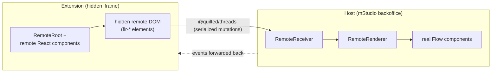

# Remote-UI ("flr") — how it works and what it means for components

This document explains Flow's remote-UI system for **contributors** — the people
(and agents) who build and change components in this repository. It covers how
the system works end to end, why it is built this way, and — most importantly —
what remote-capability means when you implement or change a component.

This is not extension-developer documentation. That lives on
<https://flow.mittwald.de> (`apps/docs`, in German). This document is about
building the Flow components themselves.

## Why remote-UI exists

mStudio extensions run inside a hidden iframe, sandboxed away from the host (the
mittwald backoffice) for security. Yet the UI an extension produces has to look
and feel like it belongs in the backoffice — buttons, tables, forms, and layouts
that are indistinguishable from the surrounding product. Remote-UI is the system
that bridges that gap: extensions describe their UI in terms of Flow components,
and the host renders real Flow components on their behalf.

The alternative — shipping a component library inside every extension bundle —
was rejected for reasons that all trace back to control. A bundled library
cannot be sandboxed away from the host DOM without losing visual consistency,
since every extension would carry its own (possibly stale) copy of the design
system and render it without any central oversight. Remote-UI instead keeps one
set of real Flow components under the host's control: the host decides which
version of a component actually renders, can evolve components without requiring
every extension to rebuild and redeploy in lockstep, and can serve many
extensions — built against different remote versions — from a single, consistent
rendering surface. This is also why the connection protocol between extension
and host is versioned (see
[Versioning & backwards compatibility](#versioning--backwards-compatibility)): a
host will run for years next to extensions built against older remote releases.

## End-to-end architecture

At the center of remote-UI is a data flow between two runtimes. The extension
renders a `RemoteRoot` tree built from remote React components; that tree
materializes as a hidden remote DOM of `flr-*` elements — never attached to any
visible document, since the extension iframe itself stays hidden. Every mutation
to that hidden tree is serialized and sent across a
[`@quilted/threads`](https://github.com/lemonmade/quilt) connection to the host.
On the host side, a `RemoteReceiver` accepts the incoming mutations and a
`RemoteRenderer` maps each `flr-*` element to its real Flow component
counterpart, so the backoffice ends up rendering actual Flow components — not a
re-implementation of them. Events run in the opposite direction: user
interaction on the rendered host component is captured and forwarded back across
the same connection so the handler, which lives in the extension, can respond to
it.



The connection layer itself is not bespoke: it is built on a fork of
[Shopify's remote-dom](https://github.com/Shopify/remote-dom), published under
the `@mittwald/remote-dom-*` scope, which supplies the generic custom-element
and serialization machinery that Flow's own packages specialize.

Five packages divide the responsibilities along this flow:

| Package                                  | Side   | Role                                                                                                               |
| ---------------------------------------- | ------ | ------------------------------------------------------------------------------------------------------------------ |
| `@mittwald/flow-remote-core`             | both   | Connection + serialization (`@quilted/threads`); the versioned protocol.                                           |
| `@mittwald/flow-remote-react-components` | remote | React API extensions program against (`RemoteRoot`, generated `flr-*` React components).                           |
| `@mittwald/flow-remote-elements`         | remote | Custom `flr-*` elements (`FlowRemoteElement` base + a few hand-written ones).                                      |
| `@mittwald/flow-remote-react-renderer`   | host   | Maps `flr-*` elements to real Flow components; `RemoteRendererBrowser` wires the hidden iframe + `RemoteReceiver`. |
| `@mittwald/flow-react-components`        | both   | The components themselves; `@flr-generate` marks the ones that get remote artifacts.                               |

## The mental model

The clearest way to think about remote-UI is as two worlds separated by a
serialization boundary: the **remote** world (the extension, running inside the
hidden iframe) and the **host** world (the backoffice). Everything that crosses
between them has to survive being serialized, sent over the thread connection,
and deserialized on the other side. `FlowThreadSerialization`
(`packages/remote-core/src/serialization/FlowThreadSerialization.ts`)
deliberately excludes `HTMLElement` and `window` from what it will serialize —
they simply cannot mean anything on the other side of the boundary. The `flr-*`
custom elements exist precisely to stand in for host components inside this
boundary: the remote side only ever manipulates `flr-*` elements, never a real
DOM node.

```text
  REMOTE (iframe)                    │  thread boundary  │      HOST (backoffice)
  ────────────────                   │                   │      ─────────────────
  state · data loading · effects     │  serialized       │  mirror of remote output
  Suspense resolves here             │  mutations  ────► │  real Flow components render
  flr-* output tree                  │                   │
  event handlers run here      ◄──── │  events           │  every event forwarded back

  crosses:      serializable props · on* events (detail only) · slots (ReactNode)
  never crosses: HTMLElement/window · ref · controller · tunnel · return values
```

**Render-and-mirror, events-back.** The relationship between the two sides is
directional, not symmetric. The host renders only what the remote emits — it is
a mirror of the remote output tree, nothing more. In the other direction, the
host forwards **all** events back to the remote side, where the actual event
handlers run. This is why state and logic live on the remote side: the host is
deliberately "dumb", a rendering surface that reflects output and relays input.

**Everything rendered remote-side must itself be remote-capable.** This is the
general principle the boundary enforces. In extension code, it is guaranteed
structurally: extension developers can only render components imported from
`@mittwald/flow-remote-react-components`, so there is no way to accidentally
render something the host cannot mirror (this is a user-land concern for
extension developers and out of scope here). The contributor-side equivalent —
what this means when you compose components _inside_ Flow itself — is covered in
[Implementing a component](#implementing-a-component), where composing through
views (`@/views/*`) is what keeps a composite component remote-safe.

Two worked examples make the principle concrete:

- **List.** Data loading for `List` runs entirely on the remote side
  (`List/setupComponents/ListLoaderAsync*`, `List/model/ListSettingsStore`). The
  loading state is rendered by the remote and mirrored to the host; once data
  arrives, the list entries themselves are produced remotely and mirrored the
  same way. The remote side holds the state and drives the interaction end to
  end — the host only reflects whatever output currently exists and relays
  events (like a row click) back.
- **Suspense.** Suspense resolves on the remote side too. The Suspense boundary
  itself renders no DOM elements, so nothing is transmitted across the boundary
  for the boundary mechanism itself — only its `fallback` crosses, and the
  fallback, like anything rendered remote-side, must be remote-capable.
  `SuspenseTrigger`
  (`packages/components/src/components/SuspenseTrigger/SuspenseTrigger.tsx`)
  illustrates the underlying mechanism: it renders a lazy element that never
  resolves, which is enough to hold a boundary suspended for testing or demo
  purposes.

## The generation pipeline

A component becomes remote-capable by carrying a `/** @flr-generate all */`
JSDoc tag directly above its declaration (see, for example,
`packages/components/src/components/Button/Button.tsx`). The `all` value is
decorative — the generator only checks that the `flr-generate` tag is _present_
on the component, not what value it carries.

That single tag drives a chain of generated artifacts:

- `view.ts` next to the component, plus a generated view component under
  `packages/components/src/views/` (e.g. `<Name>View.tsx`) — the piece that lets
  other components compose it transparently through `@/views/*` (see
  [Implementing a component](#implementing-a-component)).
- A custom `flr-*` element in `packages/remote-elements/src/auto-generated/`.
- A remote React component in
  `packages/remote-react-components/src/auto-generated/`, which is what
  extension code actually imports and renders.
- An entry in the host-side component map in
  `packages/remote-react-renderer/src/auto-generated/`, which is what lets
  `RemoteRenderer` turn the `flr-*` element back into the real component.

The whole pipeline runs with `pnpm nx build:remote-components components` (or
simply `pnpm build`, which runs every generator). It depends on prop
documentation extracted from JSDoc: `pnpm nx build:docs-properties components`
writes `packages/components/dist/assets/doc-properties.json`, which the
remote-components generator reads to decide which props become which kind of
contract (see [How props cross the boundary](#implementing-a-component)).
Because of this dependency, changing prop JSDoc without rebuilding leaves the
generated artifacts out of sync.

Generated files are committed, never hand-edited — every header on a generated
file says so, and CI enforces this with `git diff --exit-code` after running the
build. Fixing something that looks wrong in a generated file means fixing the
generator or the source component and regenerating, not editing the output
directly.

## Implementing a component

### Three ways a component participates in remote

Every component in `packages/components` falls into exactly one of three
categories, and the category determines what you can and cannot do with it.

- **Self remote-capable** — annotated `/** @flr-generate all */`. Generation
  turns it into a self-contained remote unit with its own `flr-*` element. From
  the remote side it is "closed": the only way to extend what it renders is
  through its `children`, and its props are exactly the serialized contract
  described below — nothing more crosses the boundary.
- **Universal component** — carries no `@flr-generate` annotation but is
  exported additionally from `src/index/flr-universal.ts`. It wires and renders
  other remote-capable components itself rather than owning an `flr-*` element
  directly. Inside it, compose **only** through view components (`@/views/*`): a
  view renders the plain Flow component locally, or its `flr-*` counterpart when
  running in a remote context. This local/remote switch inside a single import
  is exactly what lets a composite component work correctly in both worlds.
- **Host-only** — exported only from `src/components/public.ts`, with no sibling
  `view.ts`, no `@flr-generate` tag, and absent from `flr-universal.ts`
  (examples: `Activity`, `RouterProvider`, the `OverlayTrigger` wrapper). It has
  no `flr-*` element and cannot render remotely at all. **Gotcha:** if a
  universal component composes a host-only component through a direct
  `@/components/*` import instead of a view, it will silently render nothing in
  a remote context — there is no error, the output is just missing (see
  `packages/components/PATTERNS.md:274-277`).

### State, data loading, and side effects belong on the remote side

Because the host only mirrors output and relays events (see
[The mental model](#the-mental-model)), any logic that produces or reacts to
state — fetching data, tracking loading states, sorting or filtering, controlled
input state — has to run on the remote side. Never assume that a piece of your
component's logic executes on the host; the host has nothing to run it against.
The `List` example above is the pattern to follow: state and behavior live
remotely, and the host only ever shows the latest emitted output.

### How props cross the boundary — the contract mechanics

The remote-components generator classifies every prop of a `@flr-generate`
component
(`packages/components/dev/remote-components-generator/lib/propClassifiers.ts`),
and the classification decides how that prop behaves once it crosses into remote
territory:

- **Callbacks must be named `on[A-Z]…`** to become cross-boundary _events_. A
  function prop under any other name is treated as an ordinary serialized
  property, not an event. The event name is derived from the prop name minus the
  `on` prefix, with the first letter lowercased — `onPress` becomes the `press`
  event.
- **Event handlers receive exactly one argument: the event's `detail`** — not a
  DOM or synthetic event. There is no `preventDefault`, `target`, or
  `currentTarget` to call. Callbacks are proxied across the thread connection
  and are effectively **async and fire-and-forget**: whatever the handler
  returns does not cross back, so patterns like "return `false` to cancel" only
  work within a single runtime.
- **Props typed `ReactNode` become slots**, not serialized data — they cross as
  rendered child content rather than as values that get cloned across the
  connection.
- **There are no HTML attributes.** `isAttribute` in the generator is hard-coded
  to `false`
  (`packages/components/dev/remote-components-generator/lib/propClassifiers.ts`),
  so every non-event, non-slot prop is treated as a serialized _property_ —
  don't rely on boolean or number props reflecting as DOM attributes on the
  `flr-*` element.
- **Non-serializable props generate cleanly but break at runtime.** Class
  instances lose their prototype once cloned, `HTMLElement` and `window` coerce
  to `null`, and raw DOM events degrade to near-empty objects. Nothing in the
  type system stops you from adding such a prop to a `@flr-generate` component —
  it will only misbehave once actually exercised across the boundary. This is
  exactly why the ignore list below exists.

Props of a `@flr-generate` component form a **contract** with extension
developers: they can be relied on across arbitrary remote versions, so changing
or removing one is a breaking change. Evolve them instead by adding new props
and deprecating the old ones with `useWarnDeprecation` (see
[Versioning & backwards compatibility](#versioning--backwards-compatibility)).

### The ignore list, and why `ref` / `controller` / `tunnel` don't cross

Some props are excluded from generation outright, either globally or per
component. The global ignore list lives in
`packages/components/dev/remote-components-generator/config.ts`: `style`,
`dangerouslySetInnerHTML`, `ref`, `controller`, `tunnel`, `key`, `children`, and
`wrapWith`. A component can additionally exclude one of its own props with a
`@flr-ignore-props` JSDoc tag.

Three of these deserve a specific explanation, because they look like they
should cross the boundary and deliberately don't:

- **`ref`** resolves to the _remote_ custom element, not to any host DOM node —
  there is no host element to hand back. Patterns that rely on a host DOM
  measurement or imperative call (`getBoundingClientRect`, `focus`) simply have
  nothing to attach to across the boundary.
- **`controller`** is a live MobX object that drives rendering on the **remote**
  side. It coordinates components within the same remote tree; it has no
  host-side counterpart to coordinate with.
- **`tunnel`** is an intra-tree portal (`@mittwald/react-tunnel`) that resolves
  entirely before anything crosses the boundary — it is not a boundary-crossing
  mechanism at all, just implemented with the same "cannot serialize"
  characteristics as the others.

### Controlled text inputs need echo-suppression

Every keystroke in a controlled remote text input has to round-trip
asynchronously: the remote side updates its value, serializes the change, sends
it to the host, the host renders it, and — for a controlled field — the new
value has to make it back to the remote side as a prop update. Naively wiring
this up causes dropped or reordered characters under fast typing, so controlled
text fields pair `useControlledRemoteValueProps` (used on the remote side) with
`useControlledHostValueProps` (used on the host side) to suppress the echo of a
value the remote side just sent.

This pairing is opted into through a hardcoded allowlist,
`controlledComponentNames`, in
`packages/remote-react-components/src/lib/createRemoteComponent.ts`. Adding a
new controlled remote text field means adding its `flr-*` tag name to that list
— skip it, and the field will drop characters under fast typing.

### Placement and registration for a new remote-capable component

A new `@flr-generate` component has two placement requirements beyond the
annotation itself: it must live under `src/components` or `src/integrations` in
`packages/components` (the glob the doc-extraction step scans), and it must be
registered in the hand-maintained `FlowComponentPropsTypes` registry at
`packages/components/src/components/propTypes/index.ts`. Miss either one and the
component is silently skipped by the generator or fails typecheck — there is no
generator-side error pointing at the missing registration.

### PropsContext — only remote-capable components belong in one

`PropsContext` is plain React context: it is resolved independently on each side
of the boundary and is never itself serialized. That independence has a
consequence worth internalizing. A host `PropsContextProvider` placed above
`<RemoteRenderer>` _does_ reach the mirrored `flr-*` components, because each
one becomes a host `flowComponent` that re-reads context from its position in
the host's React tree. But a non-remote-capable child that lives only inside the
extension iframe resolves context purely against the iframe's own tree — it has
no path back to host-side context — so it silently misses whatever the host
provider set, without any warning that the value never arrived. Only put
remote-capable components in a `PropsContext` that is meant to reach across the
boundary.

### Definition of Done for a remote-capable component

Beyond the general
[Definition of Done](../AGENTS.md#definition-of-done--component-work) for
component work, a remote-capable component additionally needs: regenerated and
committed generated artifacts, a demo page in `apps/remote-dom-demo`, and
passing visual tests in **both** the `Local` and `Remote` test targets.

## Versioning & backwards compatibility

## Host-side rendering — special cases

## Where to go deeper
