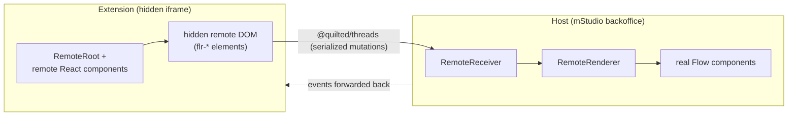

# Remote-UI ("flr") — how it works and what it means for components

This document explains Flow's remote-UI system for **contributors** — the people
(and agents) who build and change components in this repository. It covers how
the system works end to end, why it is built this way, and — most importantly —
what remote-capability means when you implement or change a component.

This is not extension-developer documentation. That lives on
<https://flow.mittwald.de> (`apps/docs`, in German). This document is about
building the Flow components themselves.

## Why remote-UI exists

mStudio extensions run inside a hidden iframe, sandboxed away from the host (the
mittwald backoffice) for security. Yet the UI an extension produces has to look
and feel like it belongs in the backoffice — buttons, tables, forms, and layouts
that are indistinguishable from the surrounding product. Remote-UI is the system
that bridges that gap: extensions describe their UI in terms of Flow components,
and the host renders real Flow components on their behalf.

The alternative — shipping a component library inside every extension bundle —
was rejected for reasons that all trace back to control. A bundled library
cannot be sandboxed away from the host DOM without losing visual consistency,
since every extension would carry its own (possibly stale) copy of the design
system and render it without any central oversight. Remote-UI instead keeps one
set of real Flow components under the host's control: the host decides which
version of a component actually renders, can evolve components without requiring
every extension to rebuild and redeploy in lockstep, and can serve many
extensions — built against different remote versions — from a single, consistent
rendering surface. This is also why the connection protocol between extension
and host is versioned (see
[Versioning & backwards compatibility](#versioning--backwards-compatibility)): a
host will run for years next to extensions built against older remote releases.

## End-to-end architecture

At the center of remote-UI is a data flow between two runtimes. The extension
renders a `RemoteRoot` tree built from remote React components; that tree
materializes as a hidden remote DOM of `flr-*` elements — never attached to any
visible document, since the extension iframe itself stays hidden. Every mutation
to that hidden tree is serialized and sent across a
[`@quilted/threads`](https://github.com/lemonmade/quilt) connection to the host.
On the host side, a `RemoteReceiver` accepts the incoming mutations and a
`RemoteRenderer` maps each `flr-*` element to its real Flow component
counterpart, so the backoffice ends up rendering actual Flow components — not a
re-implementation of them. Events run in the opposite direction: user
interaction on the rendered host component is captured and forwarded back across
the same connection so the handler, which lives in the extension, can respond to
it.



The connection layer itself is not bespoke: it is built on a fork of
[Shopify's remote-dom](https://github.com/Shopify/remote-dom), published under
the `@mittwald/remote-dom-*` scope, which supplies the generic custom-element
and serialization machinery that Flow's own packages specialize.

Five packages divide the responsibilities along this flow:

| Package                                  | Side   | Role                                                                                                               |
| ---------------------------------------- | ------ | ------------------------------------------------------------------------------------------------------------------ |
| `@mittwald/flow-remote-core`             | both   | Connection + serialization (`@quilted/threads`); the versioned protocol.                                           |
| `@mittwald/flow-remote-react-components` | remote | React API extensions program against (`RemoteRoot`, generated `flr-*` React components).                           |
| `@mittwald/flow-remote-elements`         | remote | Custom `flr-*` elements (`FlowRemoteElement` base + a few hand-written ones).                                      |
| `@mittwald/flow-remote-react-renderer`   | host   | Maps `flr-*` elements to real Flow components; `RemoteRendererBrowser` wires the hidden iframe + `RemoteReceiver`. |
| `@mittwald/flow-react-components`        | both   | The components themselves; `@flr-generate` marks the ones that get remote artifacts.                               |

## The mental model

The clearest way to think about remote-UI is as two worlds separated by a
serialization boundary: the **remote** world (the extension, running inside the
hidden iframe) and the **host** world (the backoffice). Everything that crosses
between them has to survive being serialized, sent over the thread connection,
and deserialized on the other side. `FlowThreadSerialization`
(`packages/remote-core/src/serialization/FlowThreadSerialization.ts`)
deliberately excludes `HTMLElement` and `window` from what it will serialize —
they simply cannot mean anything on the other side of the boundary. The `flr-*`
custom elements exist precisely to stand in for host components inside this
boundary: the remote side only ever manipulates `flr-*` elements, never a real
DOM node.

```text
  REMOTE (iframe)                    │  thread boundary  │      HOST (backoffice)
  ────────────────                   │                   │      ─────────────────
  state · data loading · effects     │  serialized       │  mirror of remote output
  Suspense resolves here             │  mutations  ────► │  real Flow components render
  flr-* output tree                  │                   │
  event handlers run here      ◄──── │  events           │  every event forwarded back

  crosses:      serializable props · on* events (detail only) · slots (ReactNode)
  never crosses: HTMLElement/window · ref · controller · tunnel · return values
```

**Render-and-mirror, events-back.** The relationship between the two sides is
directional, not symmetric. The host renders only what the remote emits — it is
a mirror of the remote output tree, nothing more. In the other direction, the
host forwards **all** events back to the remote side, where the actual event
handlers run. This is why state and logic live on the remote side: the host is
deliberately "dumb", a rendering surface that reflects output and relays input.

**Everything rendered remote-side must itself be remote-capable.** This is the
general principle the boundary enforces. In extension code, it is guaranteed
structurally: extension developers can only render components imported from
`@mittwald/flow-remote-react-components`, so there is no way to accidentally
render something the host cannot mirror (this is a user-land concern for
extension developers and out of scope here). The contributor-side equivalent —
what this means when you compose components _inside_ Flow itself — is covered in
[Implementing a component](#implementing-a-component), where composing through
views (`@/views/*`) is what keeps a composite component remote-safe.

Two worked examples make the principle concrete:

- **List.** Data loading for `List` runs entirely on the remote side
  (`List/setupComponents/ListLoaderAsync*`, `List/model/ListSettingsStore`). The
  loading state is rendered by the remote and mirrored to the host; once data
  arrives, the list entries themselves are produced remotely and mirrored the
  same way. The remote side holds the state and drives the interaction end to
  end — the host only reflects whatever output currently exists and relays
  events (like a row click) back.
- **Suspense.** Suspense resolves on the remote side too. The Suspense boundary
  itself renders no DOM elements, so nothing is transmitted across the boundary
  for the boundary mechanism itself — only its `fallback` crosses, and the
  fallback, like anything rendered remote-side, must be remote-capable.
  `SuspenseTrigger`
  (`packages/components/src/components/SuspenseTrigger/SuspenseTrigger.tsx`)
  illustrates the underlying mechanism: it renders a lazy element that never
  resolves, which is enough to hold a boundary suspended for testing or demo
  purposes.

## The generation pipeline

## Implementing a component

## Versioning & backwards compatibility

## Host-side rendering — special cases

## Where to go deeper
